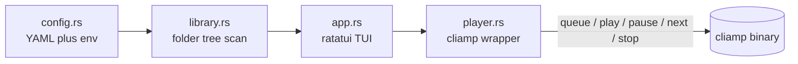

# Soundlib: Rust TUI library for cliamp

## Goal
A ratatui-based terminal app in the existing [soundlib-rs](Cargo.toml) project that browses `/home/luca/Nextcloud/_media/Soundtracks` (configurable), lets you select folders or single audio files, and plays them via `cliamp queue <file>` (recursive, sorted, for folders).

## Architecture

## Configuration (`src/config.rs`)
- YAML file at `~/.config/soundlib/config.yaml` (path via `dirs` crate), auto-created with defaults on first run:
  - `library_root: /home/luca/Nextcloud/_media/Soundtracks`
  - `audio_extensions: [mp3, flac, ogg, opus, wav, m4a]`
  - `cliamp_bin: cliamp`
- Env var overrides (take precedence over YAML): `SOUNDLIB_ROOT`, `SOUNDLIB_CLIAMP_BIN`, `SOUNDLIB_CONFIG` (alternate config path).

## Library scan (`src/library.rs`)
- Walk `library_root` with `walkdir`, build an in-memory tree of folders and audio files (filtered by extension, case-insensitive), sorted naturally per directory.
- Helper: `collect_tracks(node) -> Vec<PathBuf>` returning all audio files under a folder recursively in sorted order (used when a folder is selected).
- `r` key re-scans the library.

## Player (`src/player.rs`)
- Thin wrapper around `std::process::Command`:
  - `queue_track(path)` → `cliamp queue <path>`; queuing a folder calls this per file (selecting a folder first issues `stop` so it replaces, then queues all tracks).
  - Transport passthroughs: `play`, `pause`/`toggle`, `next`, `prev`, `stop`.
- Surface stderr from failed cliamp invocations in the TUI status line instead of crashing.

## TUI (`src/app.rs` + `main.rs`)
- Crates: `ratatui`, `crossterm`, `anyhow`, `serde`, `serde_yaml_ng`, `walkdir`, `dirs`.
- Single-pane tree browser of the library with expand/collapse folders; status bar showing last action / errors.
- Keybindings:
  - Up/Down or `j`/`k`: move; Right/`l` or Enter on folder: expand; Left/`h`: collapse/go to parent
  - Enter on file: stop + queue that file; `Enter` on folder header (or `p`): stop + queue folder recursively
  - `a`: append selection to queue without stopping
  - Space: toggle play/pause, `n`/`b`: next/prev, `s`: stop
  - `/`: filter-as-you-type within the tree, Esc clears
  - `r`: rescan, `q`: quit
- Proper terminal setup/teardown (raw mode + alternate screen, restored on panic via hook).

## Files
- `Cargo.toml` – add dependencies
- `src/main.rs` – entry: load config, scan library, run TUI event loop
- `src/config.rs`, `src/library.rs`, `src/player.rs`, `src/app.rs`

## Verification
- `cargo build`, then run against the real Soundtracks folder and queue a track/folder via cliamp.